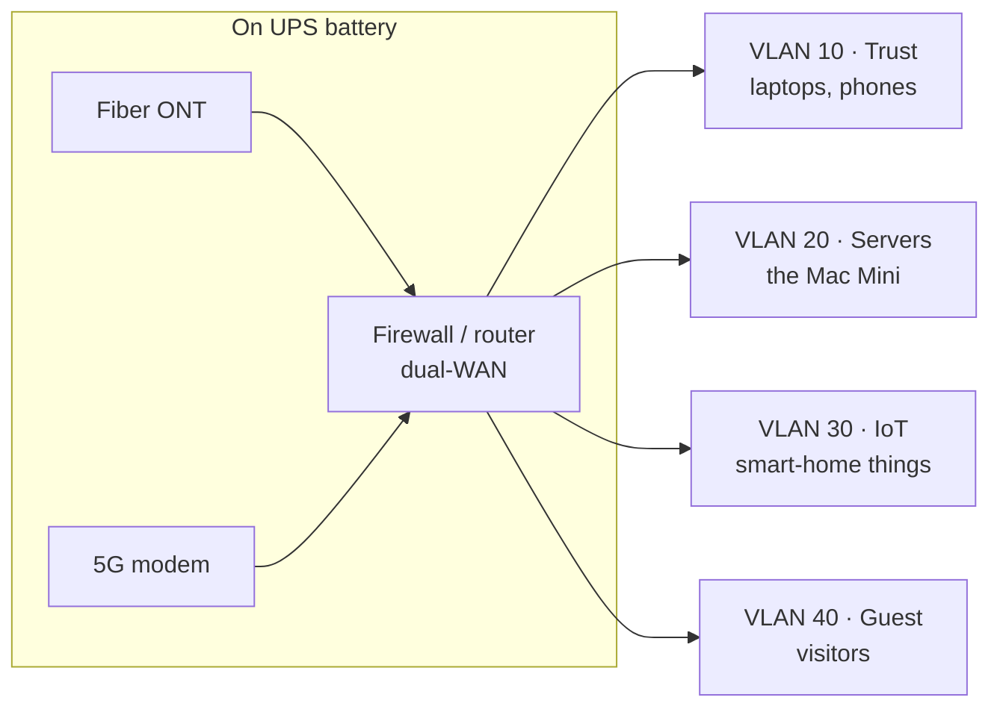

## Context

The other recipes treat "the network" as a thing that's just *there*. This one is about the network itself — the part of the homelab that decides whether your services are reachable, whether a power blip becomes an outage, and whether a compromised smart bulb can see your database.

This recipe is more architecture than command line. The hardware specifics (a Firewalla here) don't matter much; the *shape* does. The shape is what survives a hardware swap.

## The shape

Four ideas, in order of how much they'll hurt if you skip them:

1. **Two ways out** — primary ISP plus a cellular backup.
2. **One firewall** that does routing, failover, and segmentation.
3. **VLANs** so a breach in one zone isn't a breach everywhere.
4. **Battery backup** for everything that must not blink.

## Two ways out: primary + backup ISP

A homelab that hosts real services has an uptime expectation, even if the only person enforcing it is you at 7am wondering why a site is down. A single ISP is a single point of failure, and ISPs go down — maintenance, a cut line, a neighborhood outage.

So: a **primary** wired connection (fiber, in this setup) and a **backup** that fails over automatically. Cellular 5G is a good backup precisely *because* it's a different kind of link — a backhoe through your fiber doesn't touch a cell tower.

**Don't worry about CGNAT.** Cellular ISPs almost never give you a real public IP — you're behind carrier-grade NAT, with no inbound reachability at all. For a traditional "port-forward to your server" setup, that's fatal. For *this* homelab, it's a non-issue, because nothing depends on inbound connections. Every public service is fronted by a Cloudflare Tunnel, which is an *outbound* connection. Outbound works fine through CGNAT. This is the single design choice that makes cheap cellular failover actually viable — see the dedicated section below.

## One firewall

The firewall is the brain. One appliance handles:

- **Routing** between the internet and your internal network.
- **Dual-WAN failover** — health-check the primary link, and when it fails, move traffic to the backup automatically. Configure it to *fail back* to the primary when it recovers, so you're not paying for cellular data longer than necessary.
- **VLAN segmentation and inter-VLAN firewall rules** (next section).
- **Visibility** — knowing what's on your network and what it's talking to.

This setup uses a Firewalla because it does all of the above in one box without a CLI degree. Use whatever you like — UniFi, OPNsense, pfSense, a Mikrotik. The requirements are the same: dual-WAN, VLANs, and per-VLAN rules. If a device can't do those three things, it's a router, not a homelab firewall.

## VLANs: don't run everything flat

A flat network — every device on one subnet, everything able to talk to everything — is the default, and it's fine right up until it isn't. The problem is the modern home: a dozen IoT gadgets running firmware last patched during a previous administration, all sharing a broadcast domain with the machine that holds your database.

VLANs split one physical network into isolated virtual ones. A reasonable homelab split:

| VLAN | Zone | What's on it | Can reach |
|------|------|--------------|-----------|
| 10 | **Trust** | Laptops, phones, your actual computers | Everything (it's you) |
| 20 | **Servers** | The Mac Mini, anything infrastructure | Internet out; serves Trust |
| 30 | **IoT** | Smart bulbs, plugs, TVs, the cheap stuff | Internet only — *no* lateral access |
| 40 | **Guest** | Visitors' devices | Internet only, isolated from all of it |

The rule that does the work: **IoT and Guest get internet and nothing else.** A compromised smart bulb on VLAN 30 can phone home all it likes — it cannot see, scan, or reach the Mac Mini on VLAN 20. You've turned "one device is owned" into a contained event instead of a full-house event.

One honest caveat: IoT segmentation breaks casual discovery. Your phone on Trust won't automatically find a Chromecast on IoT, because that's the *entire point* — discovery protocols are lateral traffic. Most firewalls have an mDNS-reflector or a narrow "allow Trust → IoT" rule to punch a specific hole. Set that up deliberately, per service, rather than collapsing the wall. Slightly more annoying; dramatically safer.

## Battery backup

Put a UPS between the wall and everything *above* the firewall line in the diagram: the fiber ONT, the cellular modem, the firewall, the switch, and the Mac Mini.

Two reasons, and the second is the one people forget:

1. **Ride out short outages.** Most residential power events are blips and brownouts measured in seconds. A UPS turns those into nothing at all. Your services don't even notice.
2. **Protect the database from a dirty shutdown.** This is the real reason. Yanking power from a machine mid-write is how databases get *corrupted*, not just stopped. PostgreSQL gets backed up off-site precisely so a bad shutdown is survivable — but a UPS means you mostly don't roll those dice. Power blips shouldn't be a database event.

Size the UPS for *runtime*, not just wattage — enough battery to coast through the short stuff, and ideally enough to trigger a graceful shutdown if an outage runs long. The goal isn't to run for hours off battery. It's that a flicker is a non-event and a real outage ends cleanly.

## Seamless ISP failover via Cloudflare Tunnels

Here's the payoff, and it's worth understanding *why* it works, not just that it does.

**The old way.** Traditional self-hosting means port-forwarding: a public IP, holes in the firewall, inbound traffic. That model is brittle against everything in this recipe. Your public IP changes, so you need dynamic DNS. Failover to cellular *can't work at all*, because CGNAT means there's no inbound path. A WAN failover would change your public IP and break every port-forward.

**The tunnel way.** A Cloudflare Tunnel inverts the direction. `cloudflared` runs on the Mac Mini and makes an **outbound** connection *up* to Cloudflare's edge. Your public hostnames resolve to Cloudflare, always. Cloudflare routes requests *down* the tunnel that's already connected. At no point does anything on the internet connect *inbound* to your house.

Now watch what happens when the fiber drops:

1. The firewall's health check notices the primary WAN is down and moves traffic to the 5G backup. A few seconds.
2. The Mac Mini's outbound path to the internet now runs over cellular instead of fiber. Its route changed; nothing else did.
3. `cloudflared` notices its connection dropped and re-dials — outbound, over the new path. Cellular CGNAT doesn't matter, because it's an outbound connection. A few more seconds.
4. Cloudflare sees the tunnel reconnect and resumes routing requests down it.

From the public internet, nothing changed. The hostname still resolves to Cloudflare. The certificate is still valid (TLS terminates at Cloudflare's edge). Your home's public IP changed completely, and **not one thing had to be reconfigured**, because nothing out there was ever pointed at your home's IP in the first place.

What the visitor experiences: a few seconds of "loading," then it works. What you experience, if you're not watching: nothing. The failover is invisible.

The honest fine print:

- **There's a reconnect window.** Failover isn't literally zero — budget on the order of tens of seconds end to end (firewall failover + tunnel re-dial). For a homelab, fine. For a payment processor, you wouldn't be reading a homelab recipe.
- **In-flight connections drop.** A request mid-transfer when the link flips will fail and need a retry. Long-lived connections (websockets, SSE, big uploads) reconnect rather than survive. Anything stateless just retries and you never notice.
- **Cellular backup is for outages, not for living on.** Watch your data cap. The point is to coast through a fiber outage, then fail back automatically when it recovers.

This is why the topology and the tunnel are the same story. The VLANs keep the inside safe; the *outbound* tunnel is what makes a cheap second internet connection into genuine, hands-off redundancy.

## When it breaks

### Symptom: everything is down, including from outside

Check from the top of the stack down. Is it power? (Is the UPS itself beeping — i.e. on battery?) Is it both WAN links, or has failover simply not triggered? Most firewalls show live per-WAN health; look there first. If the primary is down and traffic *hasn't* moved to backup, the failover health check is misconfigured — it's testing the wrong thing or testing nothing.

### Symptom: failover happened, but services are still unreachable

The WAN moved but the tunnel hasn't re-established. Give it the reconnect window — tens of seconds — then check `cloudflared` on the host. A tunnel that won't reconnect after a WAN flip is a tunnel problem, not a network-topology problem.

### Symptom: failover is slow, or flaps back and forth

A health check that's too aggressive will flap between WANs on a marginal primary link; too lax and failover lags. Tune the check interval and failure threshold on the firewall. You want it decisive but not twitchy — confirm the link is genuinely down before moving, then move cleanly.

### Symptom: a device can't reach something it should

Probably an inter-VLAN rule. Walk it explicitly: which VLAN is the device on, which VLAN is the target on, and does a rule permit that direction? The usual culprit is a Trust device trying to reach something on IoT (discovery again) — that's the wall working as designed. Add a narrow, specific allow rule for that one service rather than tearing the wall down.
