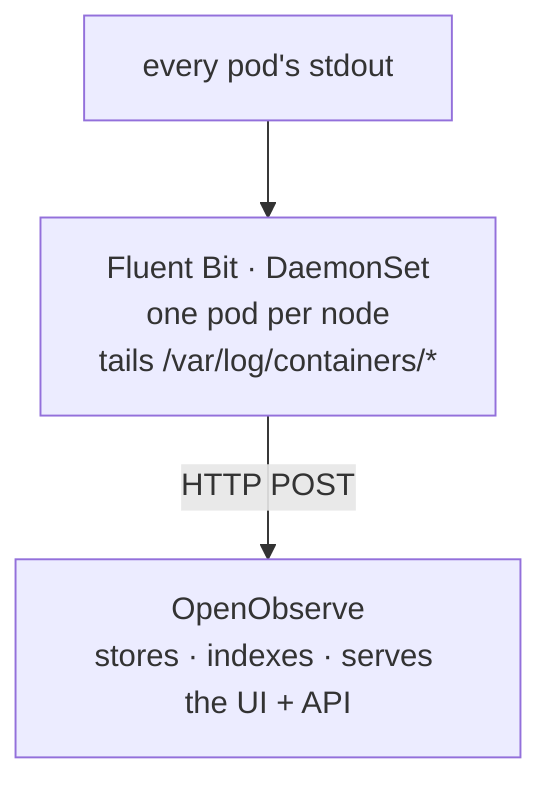

## Context

The [twelve-factor recipe](/homelab/twelve-factor) said an app's only job is to write to stdout — no log files, no rotation, no shipping. That's the easy half. The other half is *catching* every one of those streams and making them searchable, because `kubectl logs` on one pod at a time is fine right up until you have a real problem.

`kubectl logs` has three failures that bite during an actual incident:

- It only shows **one pod at a time**, and a problem rarely respects pod boundaries.
- It shows **now**, not last Tuesday — once a pod is gone, so are its logs.
- It can't **search** across everything for one request ID, one error, one user.

So you want a log aggregator: one place that holds logs from every pod, keeps history, and answers questions. This recipe uses [OpenObserve](https://openobserve.ai/).

## Why OpenObserve

The well-trodden choice is the Grafana + Loki + Promtail stack. It's capable, and it's three components to run, learn, and keep alive — on a Mac Mini that has better things to do with its memory.

OpenObserve is a lighter fit for a homelab:

- **One binary.** Rust-based, frugal with memory — it behaves itself on modest ARM hardware.
- **SQL queries.** You already know SQL. That's the whole learning curve.
- **Retention is a config value.** Set 30 days and forget it.
- **Efficient storage.** Logs land in compressed columnar (Parquet) files.

For a homelab, "fewer moving parts" beats "more features you won't use." OpenObserve wins on exactly that.

## The architecture



Two pieces:

- **Fluent Bit** — the collector. Runs as a **DaemonSet** (one instance per node), tails every container's log file, enriches each line with Kubernetes metadata (pod, namespace, labels), and forwards it.
- **OpenObserve** — the sink. Receives logs, stores them, and serves the search UI.

The apps don't know any of this exists. They write to stdout; the platform does the rest. That's the factor working as intended.

## Step 1 — Secrets and namespaces

OpenObserve needs admin credentials, and Fluent Bit needs credentials to push to it. Both come from the vault via the sync script (the [secrets recipe](/homelab/1password-secrets)). Create the credentials in your vault, then sync them into two namespaces:

- `openobserve` — the admin auth secret for the OpenObserve install.
- `fluent-bit` — the same credentials, so the collector can authenticate when it forwards.

## Step 2 — Install OpenObserve

For a single-node cluster, the standalone Helm chart is the right size:

```bash
helm repo add openobserve https://charts.openobserve.ai
helm repo update

helm install openobserve openobserve/openobserve-standalone \
  -n openobserve \
  -f openobserve-values.yaml
```

The key settings in `openobserve-values.yaml`:

- `ZO_COMPACT_DATA_RETENTION_DAYS: 30` — drop logs older than 30 days automatically.
- A persistent volume for the data directory.
- Resource limits sized for the Mac Mini — generous enough to be useful, capped so a log spike can't starve everything else.

## Step 3 — Certificate and ingress

OpenObserve gets a hostname — `logs.otterpond.dev` — and it is **internal only**. Logs are operational data; they do not go on the public internet.

- Apply an ingress for `logs.otterpond.dev`.
- It uses the wildcard TLS certificate (the [TLS recipe](/homelab/tls-letsencrypt)) — a real, browser-trusted certificate, even though the site is private.
- There is **no** Cloudflare Tunnel route for it. The only path in is the tailnet.

This is the internal-site pattern in full: real TLS via DNS-01, reachability via Tailscale, zero public exposure. Point the hostname's DNS at the Mac Mini's tailnet address and `logs.otterpond.dev` becomes a clean-padlock URL that works for you and resolves to nothing reachable for anyone else.

## Step 4 — Install Fluent Bit

```bash
helm repo add fluent https://fluent.github.io/helm-charts
helm repo update

helm install fluent-bit fluent/fluent-bit \
  -n fluent-bit \
  -f fluent-bit-values.yaml
```

`fluent-bit-values.yaml` configures it to tail `/var/log/containers/`, parse JSON log lines, enrich with Kubernetes metadata, and POST to the OpenObserve service.

### The k3d volume workaround — do not skip this

Fluent Bit's default Helm chart mounts `/etc/machine-id` from the host. On a normal Linux node that file exists. **In k3d's containerized nodes, it does not** — and the missing mount wedges every Fluent Bit pod in `ContainerCreating`, with an error like:

```
MountVolume.SetUp failed for volume "etcmachineid": hostPath type check failed
```

The fix: in `fluent-bit-values.yaml`, define volumes with the chart's `daemonSetVolumes` / `daemonSetVolumeMounts` keys (which *replace* the defaults) instead of the standard `volumes` / `volumeMounts` keys (which *append* to them), and simply leave `/etc/machine-id` out. This is a k3d-specific quirk, it has nothing to do with your config being wrong, and it will cost you an afternoon if you meet it cold. Now you won't.

## Step 5 — Query

Open `logs.otterpond.dev` (on the tailnet), sign in, and you're querying with SQL. Some starting points:

```sql
-- Everything from one namespace
SELECT * FROM default WHERE kubernetes_namespace_name = 'apps';

-- Errors from one app
SELECT * FROM default
WHERE kubernetes_container_name = 'my-app'
  AND level = 'Error';

-- Find a string anywhere in the message
SELECT * FROM default WHERE str_match(body, 'timeout');

-- Error volume by app
SELECT kubernetes_container_name, count(*) AS errors
FROM default
WHERE level = 'Error'
GROUP BY kubernetes_container_name
ORDER BY errors DESC;
```

The metadata fields (`kubernetes_namespace_name`, `kubernetes_container_name`, pod, labels) are there because Fluent Bit added them on the way through — which is why "show me errors across the whole cluster for the last hour" is one query instead of an afternoon.

## When it breaks

### Symptom: no logs showing up

Work along the pipeline. First, is the collector running on every node?

```bash
kubectl -n fluent-bit get pods -o wide
```

If pods are stuck in `ContainerCreating`, it's the `/etc/machine-id` issue from Step 4 — apply the `daemonSetVolumes` workaround.

If the pods are `Running` but logs still aren't arriving, check whether the collector can actually reach the sink:

```bash
kubectl -n fluent-bit logs -l app.kubernetes.io/name=fluent-bit | grep -i error
```

Connection or auth errors here mean the OpenObserve endpoint or the synced credentials are wrong.

### Symptom: OpenObserve pod won't start

Usually storage. Check the volume claim is bound:

```bash
kubectl -n openobserve get pvc
kubectl -n openobserve describe pod -l app.kubernetes.io/name=openobserve
```

An unbound claim means the storage provisioner didn't satisfy it — a cluster-level problem (see the [cluster-host recipe](/homelab/cluster-host)), not an OpenObserve one.

### Symptom: memory usage creeping up

Log volume spiked, or the retention window is too generous for your disk. Tighten `ZO_COMPACT_DATA_RETENTION_DAYS`, or lower the memory limit in the values file so OpenObserve stays inside a budget you've chosen rather than one it discovers by crashing.

### Symptom: can't reach the logging UI at all

`logs.otterpond.dev` is tailnet-only by design. If it won't load, first confirm you're actually *on* the tailnet — this is working as intended, not an outage. If you are on the tailnet and it still won't resolve or connect, that's a Tailscale issue; the [Tailscale recipe](/homelab/tailscale)'s reset (`tailscale down && tailscale up --reset`) is the first move.
